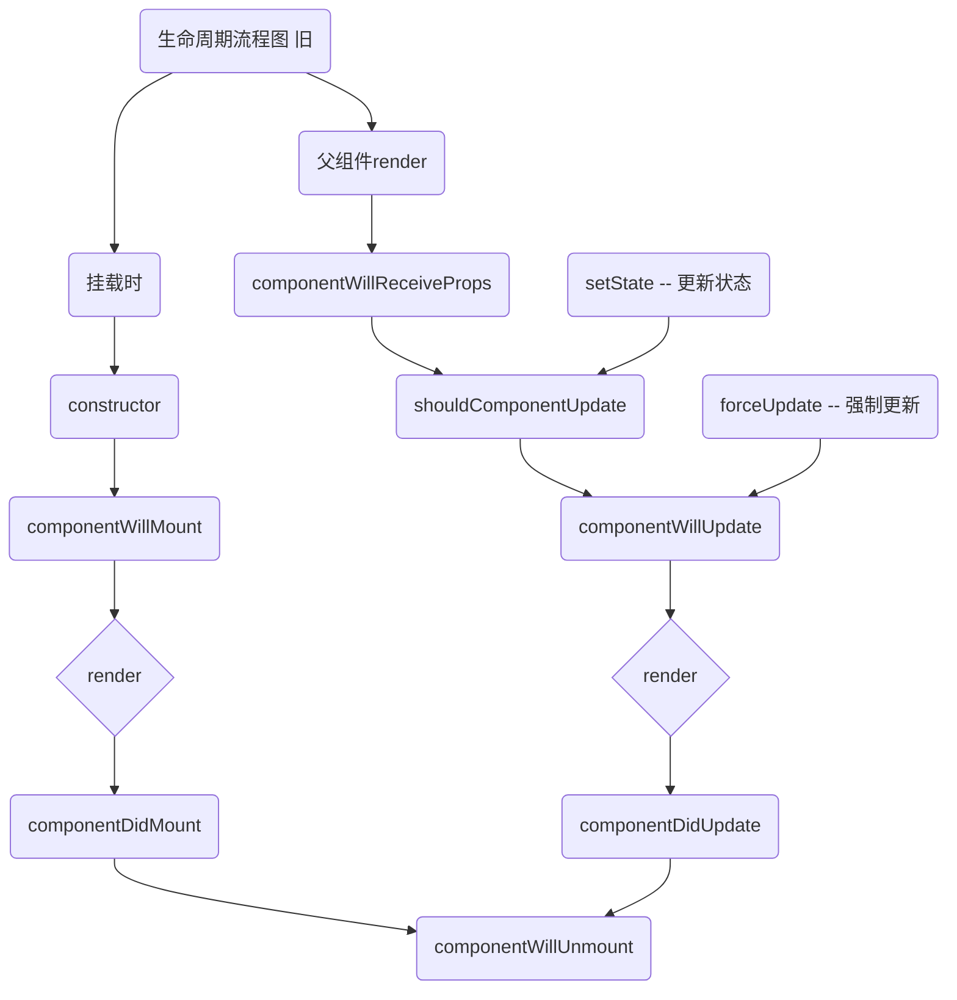
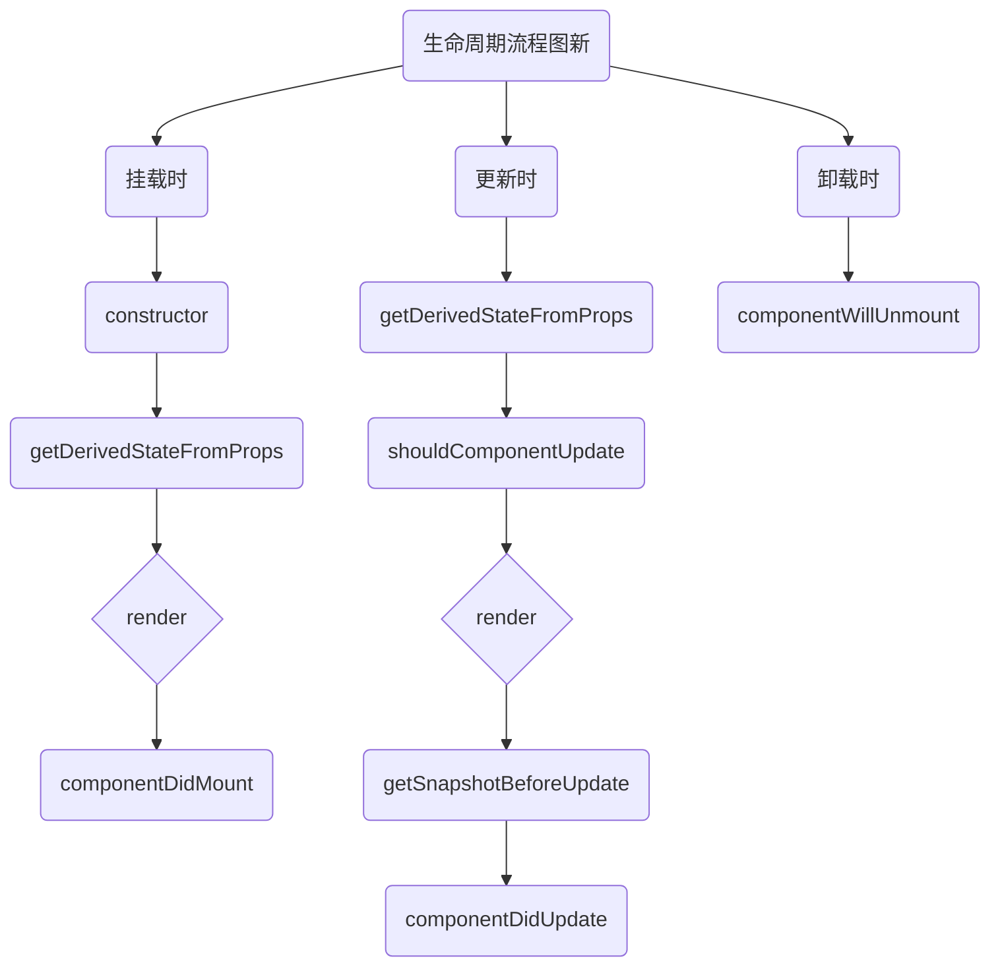

### 生命周期流程图(旧)





### 生命周期的三个阶段（旧）

1. 初始化阶段: 由ReactDOM.render()触发---初次渲染
    1. constructor()
    2. componentWillMount()
    3. render()
    4. componentDidMount() ===> 常用
     --- 一般做一些初始化的是，例如开启定时器，发生网络请求，订阅消息
2. 更新阶段: 由组件内部this.setSate()或父组件重新render触发
    1. shouldComponentUpdate()
    2. componentWillUpdate()
    3.render()
    4. componentDidUpdate()
3. 卸载组件: 由ReactDOM.unmountComponentAtNode()触发
    1. componentWillUnmount() --- 
      一般做些收尾的事，例如：关闭定时器、取消订阅

---
### 生命周期流程图(新)




### 生命周期的三个阶段（新）

1. 初始化阶段: 由ReactDOM.render()触发---初次渲染
    1. constructor()
    2. getDerivedStateFromProps 
    3. render()
    4. componentDidMount()
2. 更新阶段: 由组件内部this.setSate()或父组件重新render触发
    1. getDerivedStateFromProps
    2. shouldComponentUpdate()
    3. render()
    4. getSnapshotBeforeUpdate
    5. componentDidUpdate()
3. 卸载组件: 由ReactDOM.unmountComponentAtNode()触发
    1. componentWillUnmount()

### 重要的勾子
1. render：初始化渲染或更新渲染调用
2. componentDidMount：开启监听, 发送ajax请求
3. componentWillUnmount：做一些收尾工作, 如: 清理定时器
### 即将废弃的勾子
1. componentWillMount
2. componentWillReceiveProps
3. componentWillUpdate

---

### 生命周期(旧)
``` javascript
// 创建组件
class Count extends React.Component {
    constructor(props) {
        console.log('Count-constructor')
        super(props)
        this.state = { count: 0 }
    }
    // 加一
    add = () => {
        const { count } = this.state
        this.setState({ count: count + 1 })
    }
    // 卸载组件
    death = () => {
        ReactDOM.unmountComponentAtNode(document.getElementById('test'))
    }
    // 强制更新
    force = () => {
        this.forceUpdate();
    }

    // 组件将要挂载的钩子
    componentWillMount() {
        console.log('Count-componentWillMount')
    }
    // 组件挂载完毕的钩子
    componentDidMount() {
        console.log('Count-componentDidMount')
    }
    // 组件将要卸载的钩子
    componentWillUnmount() {
        console.log('Count-componentWillUnmount')
    }
    // 控制组件更新的阀门
    shouldComponentUpdate() {
        console.log('Count-shouldComponentUpdate')
        return true;
    }
    // 组件将要更新的钩子
    componentWillUpdate() {
        console.log('Count-componentWillUpdate')
    }
    // 组件更新完毕的钩子
    componentDidUpdate() {
        console.log('Count-componentDidUpdate')
    }

    render() {
        console.log('Count-render')
        return (
            <div>
                <h2>当前求和为{this.state.count}</h2>
                <button onClick={this.add}>点我加1</button>
                <button onClick={this.death}>卸载组件</button>
                <button onClick={this.force}>不更改状态中的数据，强制更新一下</button>
            </div>
        )
    }
// 渲染组件到页面
// ReactDOM.render(<Count />, document.getElementById('test'))
}

```
```javascript
class A extends React.Component {
    state = { carName: '奔驰' }
    changeCar = () => {
        this.setState({ carName: '宝马' })
    }
    render() {
        return (
            <div>
                <div>我是A组件</div>
                <button onClick={this.changeCar}>换车</button>
                <B carName={this.state.carName} />
            </div>
        )
    }
}

class B extends React.Component {
    // 组件将要接收新的props的钩子
    componentWillReceiveProps(props) {
        console.log('B-componentWillReceiveProps', props)
    }
    // 控制组件更新的阀门
    shouldComponentUpdate() {
        console.log('B-shouldComponentUpdate')
        return true;
    }
    // 组件将要更新的钩子
    componentWillUpdate() {
        console.log('B-componentWillUpdate')
    }
    // 组件更新完毕的钩子
    componentDidUpdate() {
        console.log('B-componentDidUpdate')
    }

    render() {
        console.log('B-render')
        return (
            <div>
                我是B组件,我接收的车是:{this.props.carName}
            </div>
        )
    }
}

// 渲染组件到页面
ReactDOM.render(<A />, document.getElementById('test'))
```
---

### 生命周期（新）
```javascript
 // 创建组件
class Count extends React.Component {
    constructor(props) {
        console.log('Count-constructor')
        super(props)
        this.state = { count: 0 }
    }
    // 加一
    add = () => {
        const { count } = this.state
        this.setState({ count: count + 1 })
    }
    // 卸载组件
    death = () => {
        ReactDOM.unmountComponentAtNode(document.getElementById('test'))
    }
    // 强制更新
    force = () => {
        this.forceUpdate();
    }

    // 组件将要挂载的钩子
    static getDerivedStateFromProps(props, state) {
        console.log('Count-getDerivedStateFromProps', props, state)
        return null
    }
    // 更新之前获取快照
    getSnapshotBeforeUpdate(prevProps, prevState) {
        console.log('Count-getSnapshotBeforeUpdate')
        return 'a'
    }

    // 更新的阀门
    shouldComponentUpdate() {
        console.log('Count-shouldComponentUpdate')
        return true;
    }

    // 组件更新完毕的钩子  prevProps 之前的props prevState 之前的状态 snapshotValue的值为快照值 a
    componentDidUpdate(prevProps, prevState, snapshotValue) {
        console.log('Count-componentDidUpdate', prevProps, prevState, snapshotValue)
    }
    // 组件挂载完毕的钩子
    componentDidMount() {
        console.log('Count-componentDidMount')
    }

    render() {
        console.log('Count-render')
        return (
            <div>
                <h2>当前求和为{this.state.count}</h2>
                <button onClick={this.add}>点我加1</button>
                <button onClick={this.death}>卸载组件</button>
                <button onClick={this.force}>不更改状态中的数据，强制更新一下</button>
            </div>
        )
    }
}

// 渲染组件到页面
ReactDOM.render(<Count count={199} />, document.getElementById('test'))
```
#### getSnapshotBeforeUpdate 示例（滚动条）
```javascript
// 样式
<style>
    .list {
        width: 200px;
        height: 150px;
        background-color: skyblue;
        overflow: auto;
    }

    .news {
        height: 30px;
    }
</style>


// 创建组件
class NewList extends React.Component {
    state = { newsArr: [] }

    componentDidMount() {
        setInterval(() => {
            // 获取原状态(结构赋值)
            const { newsArr } = this.state
            // 模拟一条新闻
            const news = '新闻' + (newsArr.length + 1)
            // 更新状态
            this.setState({ newsArr: [news, ...newsArr] })
        }, 1000)
    }

    getSnapshotBeforeUpdate(prevProps, prevState) {
        console.log(this.refs.list.scrollHeight)
        return this.refs.list.scrollHeight
    }

    componentDidUpdate(prevProps, prevState, height) {
        console.log(this.refs.list.scrollHeight)
        this.refs.list.scrollTop += this.refs.list.scrollHeight - height
    }

    render() {
        return (
            <div>
                <div className="list" ref = 'list'>
                    {
                        this.state.newsArr.map((n, index) => {
                            return <div className="news" key={index}>{n}</div>
                        })
                    }
                </div>
            </div>
        )
    }
}
// 渲染组件到页面
ReactDOM.render(<NewList />, document.getElementById('test'))
```